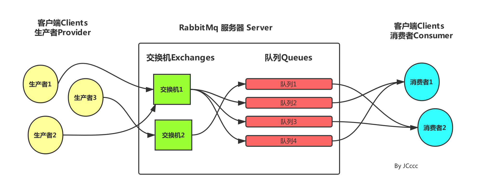

# SpringBoot-RabbitMQ

## 一、安装RabbitMQ

- [RabbitMQ安装](https://blog.csdn.net/zhm3023/article/details/82217222)

## 二、pom.xml引入Maven依赖

```xml
<dependency>
	<groupId>org.springframework.boot</groupId>
	<artifactId>spring-boot-starter-amqp</artifactId>
</dependency>
```

## 三、application.properties配置

```properties
spring.application.name=springboot-rabbitmq

spring.rabbitmq.host=127.0.0.1
spring.rabbitmq.port=5672
spring.rabbitmq.username=guest
spring.rabbitmq.password=guest

```

## 四、Example

### 1.简单

#### 发送者

- convertAndSend(`"hello"`, context);
- AmqpTemplate

```java
@Component
public class HelloSender {
	@Autowired
	private AmqpTemplate rabbitTemplate;
	public void send() {
		String context = "hello " + new Date();
		System.out.println("Sender : " + context);
		this.rabbitTemplate.convertAndSend("hello", context);
	}
}
```

#### 接收者

- `queues = "hello"`

```java
@Component
@RabbitListener(queues = "hello")
public class HelloReceiver {
    @RabbitHandler
    public void process(String hello) {
        System.out.println("Receiver  : " + hello);
    }
}
```

**注意：发送者和接收者的 queue name 必须一致，否则不能接收**

#### 配置类

- `Queue("hello");`

```java
@Configuration
public class RabbitConfig {
    @Bean
    public Queue helloQueue() {
        return new Queue("hello");
    }
}
```

#### 测试类

```java
@RunWith(SpringRunner.class)
@SpringBootTest
public class HelloTest {
	@Autowired
	private HelloSender helloSender;
	@Test
	public void hello() throws Exception {
		helloSender.send();
	}
}
```

### 2.对象

#### 发送者

```java
@Component
public class ObjectSender {
	@Autowired
	private AmqpTemplate rabbitTemplate;
	public void send(User user) {
		System.out.println("Sender object: " + user.toString());
		this.rabbitTemplate.convertAndSend("object", user);
	}
}
```

#### 接收者

```java
@Component
@RabbitListener(queues = "object")
public class ObjectReceiver {
    @RabbitHandler
    public void process(User user) {
        System.out.println("Receiver object : " + user);
    }
}
```

#### 配置类

```java
@Configuration
public class RabbitConfig {
    @Bean
    public Queue objectQueue() {
        return new Queue("object");
    }
}
```

#### 测试类

```java
@RunWith(SpringRunner.class)
@SpringBootTest
public class ObjectTest {
	@Autowired
	private ObjectSender sender;
	@Test
	public void sendOject() throws Exception {
		User user=new User();
		user.setName("object");
		user.setPass("123456");
		sender.send(user);
	}
}
```

### 3.一对多和多对多

#### 发送者

```java
//ExamSender1
@Component
public class ExamSender1 {
	@Autowired
	private AmqpTemplate rabbitTemplate;
	public void send(int i) {
		String context = "SpringBoot exam queue："+i;
		System.out.println("Sender1 : " + context);
		this.rabbitTemplate.convertAndSend("exam", context);
	}
}
//ExamSender2
@Component
public class ExamSender2 {
	@Autowired
	private AmqpTemplate rabbitTemplate;
	public void send(int i) {
		String context = "SpringBoot exam queue："+i;
		System.out.println("Sender2 : " + context);
		this.rabbitTemplate.convertAndSend("exam", context);
	}
}
```

#### 接收者

```java
//ExamReceiver1
@Component
@RabbitListener(queues = "exam")
public class ExamReceiver1 {
    @RabbitHandler
    public void process(String exam) {
        System.out.println("Receiver 1: " + exam);
    }
}
//ExamReceiver2
@Component
@RabbitListener(queues = "exam")
public class ExamReceiver2 {
    @RabbitHandler
    public void process(String exam) {
        System.out.println("Receiver 2: " + exam);
    }
}
```

#### 配置类

```java
@Configuration
public class RabbitConfig {
    @Bean
    public Queue examQueue() {
        return new Queue("exam");
    }
}
```

#### 测试类

```java
@RunWith(SpringRunner.class)
@SpringBootTest
public class ManyTest {
	@Autowired
	private ExamSender1 examSender1;
	@Autowired
	private ExamSender2 examSender2;
    //一对多测试
	@Test
	public void oneToMany() throws Exception {
		for (int i=0;i<10;i++){
			examSender1.send(i);
		}
	}
    //多对多测试
	@Test
	public void manyToMany() throws Exception {
		for (int i=0;i<10;i++){
			examSender1.send(i);
			examSender2.send(i);
		}
	}
}
```

## 五、交换机(Exchange)

- 交换机的功能主要是接收消息并且转发到绑定的队列，交换机不存储消息，在启用ack模式后，交换机找不到队列会返回错误。
- AMQP协议规定，AMQP消息必须有三部分，交换机，队列和绑定。生产者把消息发送到交换机，交换机与队列的绑定关系决定了消息如何路由到特定的队列，最终被消费者接收。



### 1.Topic Exchange

- Topic Exchange（主题交换机）是 RabbitMQ 中最灵活的一种方式，可以根据 routing_key 自由的绑定不同的队列

- \* **(星号) 用来表示一个单词 (必须出现的)**

- \#**(井号) 用来表示任意数量（零个或多个）单词**

- **topic.#** ：可以匹配到 topic.message1、topic.message1.message2
- **topic.*** ：只能匹配到 topic.message1，不能匹配到 topic.message1.message2

#### 发送者

```java
@Component
public class TopicSender {
	@Autowired
	private AmqpTemplate rabbitTemplate;
	public void send1() {
		String context = "Message 1";
		System.out.println("Sender : " + context);
		this.rabbitTemplate.convertAndSend("topicExchange", "topic.message1", context);
	}
	public void send2() {
		String context = "Messages 2";
		System.out.println("Sender : " + context);
		this.rabbitTemplate.convertAndSend("topicExchange", "topic.message2", context);
	}
}
```

#### 接收者

```java
//TopicReceiver1
@Component
@RabbitListener(queues = "topic.message1")
public class TopicReceiver1 {
    @RabbitHandler
    public void process(String message) {
        System.out.println("Topic Receiver1  : " + message);
    }
}
//TopicReceiver2
@Component
@RabbitListener(queues = "topic.message2")
public class TopicReceiver2 {
    @RabbitHandler
    public void process(String message) {
        System.out.println("Topic Receiver2  : " + message);
    }
}
```

#### 配置类

```java
@Configuration
public class TopicRabbitConfig {
    final static String message1 = "topic.message1";
    final static String message2 = "topic.message2";
    @Bean
    public Queue queueMessage() {
        return new Queue(TopicRabbitConfig.message1);
    }
    @Bean
    public Queue queueMessages() {
        return new Queue(TopicRabbitConfig.message2);
    }
    @Bean
    TopicExchange exchange() {
        return new TopicExchange("topicExchange");
    }
    @Bean
    Binding bindingExchangeMessage(Queue queueMessage, TopicExchange exchange) {
        return BindingBuilder.bind(queueMessage).to(exchange).with("topic.message1");
    }
    @Bean
    Binding bindingExchangeMessages(Queue queueMessages, TopicExchange exchange) {
        return BindingBuilder.bind(queueMessages).to(exchange).with("topic.#");
    }
}
```

#### 测试类

```java
@RunWith(SpringRunner.class)
@SpringBootTest
public class TopicTest {
	@Autowired
	private TopicSender sender;
	@Test
	public void topic1() throws Exception {
		sender.send1();
	}
	@Test
	public void topic2() throws Exception {
		sender.send2();
	}
}
```

### 2.Fanout Exchange

- Fanout Exchange（扇型交换机） 是广播模式或者订阅模式，给 Fanout 交换机发送消息，绑定了这个交换机的所有队列都收到这个消息。

#### 发送者

```java
@Component
public class FanoutSender {
	@Autowired
	private AmqpTemplate rabbitTemplate;
	public void send() {
		String context = "Fanout message!";
		System.out.println("Sender : " + context);
		this.rabbitTemplate.convertAndSend("fanoutExchange","", context);
	}
}
```

#### 接收者

```java
//FanoutReceiverA
@Component
@RabbitListener(queues = "fanout.A")
public class FanoutReceiverA {
    @RabbitHandler
    public void process(String message) {
        System.out.println("FanoutReceiverA : " + message);
    }
}
//FanoutReceiverB
@Component
@RabbitListener(queues = "fanout.B")
public class FanoutReceiverB {
    @RabbitHandler
    public void process(String message) {
        System.out.println("FanoutReceiverB : " + message);
    }
}
//FanoutReceiverC
@Component
@RabbitListener(queues = "fanout.C")
public class FanoutReceiverC {
    @RabbitHandler
    public void process(String message) {
        System.out.println("FanoutReceiverC : " + message);
    }
}
```

#### 配置类

```java
@Configuration
public class FanoutRabbitConfig {
    @Bean
    public Queue AMessage() {
        return new Queue("fanout.A");
    }
    @Bean
    public Queue BMessage() {
        return new Queue("fanout.B");
    }
    @Bean
    public Queue CMessage() {
        return new Queue("fanout.C");
    }
    @Bean
    FanoutExchange fanoutExchange() {
        return new FanoutExchange("fanoutExchange");
    }
    @Bean
    Binding bindingExchangeA(Queue AMessage,FanoutExchange fanoutExchange) {
        return BindingBuilder.bind(AMessage).to(fanoutExchange);
    }
    @Bean
    Binding bindingExchangeB(Queue BMessage, FanoutExchange fanoutExchange) {
        return BindingBuilder.bind(BMessage).to(fanoutExchange);
    }
    @Bean
    Binding bindingExchangeC(Queue CMessage, FanoutExchange fanoutExchange) {
        return BindingBuilder.bind(CMessage).to(fanoutExchange);
    }
}
```

#### 测试类

```java
@RunWith(SpringRunner.class)
@SpringBootTest
public class FanoutTest {
	@Autowired
	private FanoutSender sender;
	@Test
	public void fanoutSender() throws Exception {
		sender.send();
	}
}
```

### 3.Headers Exchange

- Headers Exchange（头交换机）使用多个消息属性来代替路由键建立路由规则。通过判断消息头的值能否与指定的绑定相匹配来确立路由规则。

- **whereAll**：用于匹配所有头信息
  - 经测试，只需第一条头信息匹配即可接收到信息
- **whereAny**：只需要匹配到任意一条即可。

#### 发送者

```java
@Component
public class HeadersSender {
    @Autowired
    private AmqpTemplate rabbitTemplate;
    public void send1(String msg) {
        MessageProperties messageProperties = new MessageProperties();
        //注释了下面这行接收者就收不到信息了
        //messageProperties.setHeader("queue", "queue1");
        messageProperties.setHeader("bindType", "whereAll");
        Message message = new Message(msg.getBytes(), messageProperties);
        System.out.println("Sender："+msg);
        rabbitTemplate.convertAndSend("headerExchange", null, message);
    }
    public void send2(String msg) {
        MessageProperties messageProperties = new MessageProperties();
        messageProperties.setHeader("queue", "queue2");
        messageProperties.setHeader("bindType", "whereAny");
        Message message = new Message(msg.getBytes(), messageProperties);
        System.out.println("Sender："+msg);
        rabbitTemplate.convertAndSend("headerExchange", null, message);
    }
}
```

#### 接收者

```java
//HeadersReceiver1
@Component
public class HeadersReceiver1 {
    @RabbitListener(queues = "header1")
    public void receive1(String msg) {
        System.out.println("HeadersReceiver1接收到的消息：" + msg);
    }
}
//HeadersReceiver2
@Component
public class HeadersReceiver2 {
    @RabbitListener(queues = "header2")
    public void receive2(String msg) {
        System.out.println("HeadersReceiver2接收的消息：" + msg);
    }
}
```

#### 配置类

```java
@Configuration
public class HeadersRabbitConfig {
    @Bean
    public Queue queue1() {
        return new Queue("header1");
    }
    @Bean
    public Queue queue2() {
        return new Queue("header2");
    }
    @Bean
    public HeadersExchange headersExchange() {
        return new HeadersExchange("headerExchange");
    }
    @Bean
    public Binding binding1() {
        Map<String, Object> header = new HashMap<>();
        header.put("queue", "queue1");
        header.put("bindType", "whereAll");
        return BindingBuilder.bind(queue1()).to(headersExchange()).whereAll(header).match();
    }
    @Bean
    public Binding binding2() {
        HashMap<String, Object> header = new HashMap<>();
        header.put("queue", "queue2");
        header.put("bindType", "whereAny");
        return BindingBuilder.bind(queue2()).to(headersExchange()).whereAny(header).match();
    }
}
```

#### 测试类

```java
@RunWith(SpringRunner.class)
@SpringBootTest
public class HeadersTest {
    @Autowired
    private HeadersSender sender;
    @Test
    public void headers1() throws Exception {
        String msg="Message 1";
        sender.send1(msg);
        Thread.sleep(1000*3);
    }
    @Test
    public void headers2() throws Exception {
        String msg="Message 2";
        sender.send2(msg);
        Thread.sleep(1000*3);
    }
}
```

### 4.Direct Exchange

- Direct Exchange（直连型交换机）是RabbitMQ默认的交换机模式，也是最简单的模式，根据`路由键`全文匹配去寻找队列。

#### 发送者

```java
@Component
public class DirectSender {
    @Autowired
    private RabbitTemplate rabbitTemplate;
    public void send1() {
        String msg = "Message1";
        System.out.println("Sender：" + msg);
        rabbitTemplate.convertAndSend("directExchange","routeKey1",msg);
    }
    public void send2() {
        String msg = "Message2";
        System.out.println("Sender：" + msg);
        rabbitTemplate.convertAndSend("directExchange", "routeKey2",msg);
    }
}
```

#### 接收者

```java
//DirectReceiver1
@Component
public class DirectReceiver1 {
    @RabbitListener(queues = "direct1")
    public void receiveDirect1(String msg) {
        System.out.println("DirectReceiver1：" + msg);
    }
}
//DirectReceiver2
@Component
public class DirectReceiver2 {
    @RabbitListener(queues = "direct2")
    public void receiveDirect2(String msg) {
        System.out.println("DirectReceiver2：" + msg);
    }
}
```

#### 配置类

```java
@Configuration
public class DirectRabbitConfig {
    @Bean
    public Queue directQueue1() {
        return new Queue("direct1");
    }
    @Bean
    public Queue directQueue2() {
        return new Queue("direct2");
    }
    @Bean
    public DirectExchange directExchange() {
        return new DirectExchange("directExchange");
    }
    @Bean
    public Binding bindingDirectExchange1() {
        return BindingBuilder.bind(directQueue1()).to(directExchange()).with("routeKey1");
    }
    @Bean
    public Binding bindingDirectExchange2() {
        return BindingBuilder.bind(directQueue2()).to(directExchange()).with("routeKey2");
    }
}
```

#### 测试类

```java
@RunWith(SpringRunner.class)
@SpringBootTest
public class DirectTest {
    @Autowired
    private DirectSender sender;
    @Test
    public void direct1() throws Exception {
        sender.send1();
        Thread.sleep(1000*3);
    }
    @Test
    public void direct2() throws Exception {
        sender.send2();
        Thread.sleep(1000*3);
    }
}
```

## 六、总结

- **AmqpTemplate**：一个定义了发送和接收消息的基本操作的接口。
- **RabbitTemplate**
  - 实现了RabbitOperations接口，而RabbitOperations接口又继承**AmqpTemplate**
- **this.rabbitTemplate.convertAndSend("hello","routeKey1", context);**
  - amqpTemplate.convertAndSend("交换机名"，“路由键”，“消息内容”)
  - RabbitMQ将会根据第二个参数去寻找有没有匹配此规则的队列,如果有,则把消息给它,如果有不止一个,则把消息分发给匹配的队列(每个队列都有消息!)
  - Fanout发布模式路由键被忽略
  - **输出时没有顺序，不需要等待，直接运行**
- **@RabbitListener(queues = "hello")**
  - 监听器监听指定队列"hello"。
  - 标注在类上可配合**@RabbitHandler**使用，也可直接标注在方法上。
- **@RabbitHandler**
  - 使用 @RabbitListener 注解标记方法，当监听到队列 debug 中有消息时则会进行接收并处理。
- **Queue**
  - 队列类
- **TopicExchange**
  - Topic可以通过使用通配符（ * 和 #）将消息分发到一个或者多个队列当中。
- **FanoutExchange**
  - 忽略路由键，将消息分发到所有绑定到交换机上的队列，即消息广播。
- **HeadersExchange**
  - 通过判断消息头的值能否与指定的绑定相匹配来确立路由规则。
- **DirectExchange**
  - RabbitMQ默认的交换机模式，也是最简单的模式，根据路由键全文匹配去寻找队列。
- **Binding**
  - Direct Exchange、Topic Exchange进行Binding的时候，需要指定Routing key
  - Fanout Exchange、Headers Exchange进行Binding的时候，不需要指定Routing key
- **BindingBuilder.bind(queueMessages).to(exchange).with("routeKey1");**
  - BindingBuilder.bind(指定队列).to(交换机).with(路由键);